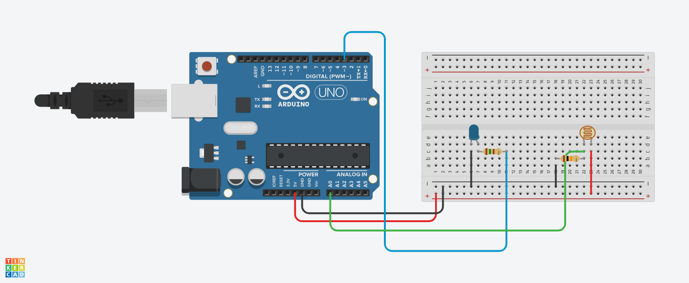

 # Projeto de Poste inteligente

 # Introdução

Este projeto foi desenvolvido no Tinkercad, como parte da disciplina de Internet das Coisas
(IoT), com o objetivo de criar um protótipo que simule um sistema de semáforo inteligente.
O sistema é projetado para controlar os sinais de trânsito destinados a veículos e pedestres,
utilizando um sensor de distância para detectar a presença de pedestres.
O funcionamento do sistema inicia com a configuração dos LEDs dos semáforos de veículos nas cores
verde, amarelo e vermelho, considerando que cada pista possui um sentido de tráfego distinto. Quando
um pedestre se aproxima a menos de 50 cm, o sensor é ativado, mudando os sinais dos veículos para 
vermelho e os dos pedestres para verde. Os semáforos dos pedestres permanecem verdes por 15 segundos
para garantir a travessia segura. Após esse período, se não houver mais pedestres detectados, os sinais
dos pedestres voltam a ficar vermelhos, permitindo que os veículos retomem o tráfego normalmente.

# componentes usados

Arduino Uno.

LED: Um diodo emissor de luz que será controlado pela leitura do sensor de luminosidade.

Resistor para o LED: Geralmente um resistor de 220Ω ou 330Ω é usado em série com o LED para limitar a corrente e evitar que o LED queime.

Sensor de Luminosidade (por exemplo, LDR - Resistor Dependente de Luz): Um componente que varia sua resistência com a quantidade de luz que incide sobre ele.

Resistor para o LDR: Um resistor (geralmente entre 10kΩ e 100kΩ) é usado em um divisor de tensão com o LDR para permitir a leitura do nível de luminosidade no pino analógico.

Fios de Conexão: Fios jumpers para fazer as ligações entre os componentes e a placa Arduino.

# Montagem do circuito

# Explicação do Código

variáveis ​​int led =3; int sensorluminosidade= A0; variável para capturar a luminosidade int luz =0;

void setup() { led é dito pinMode(led,OUTPUT); sensor é de entrada pinMode(sensorluminosidade,INPUT); }

void loop() { capturar o que o sensor leu no ambiente analogRead é usado para leitura analógica

luz = analogRead(sensorluminosidade);

SE ESTIVER COM POUCA LUZ NO AMBIENTE if(luz<500){ digitalWrite(led,HIGH); LIGAR LED

passar ao led intensidade máxima analogWrite(led,1023);

} else if (luz >= 500 && luz < 900) {

passar ao led intensidade média analogWrite(led,500);

}else{ SE TIVER LUZ digitalWrite(led,LOW); DESLIGAR LED

passar ao led intensidade mínima analogWrite(led,0);

}

}
