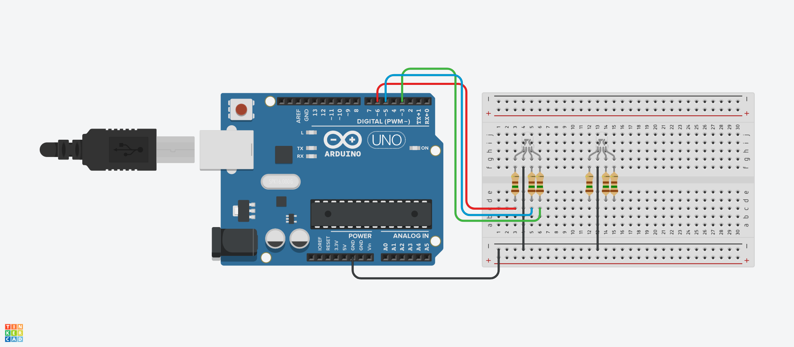

# Projeto de LED com Cores Aleatórias
# Introdução
Este projeto foi desenvolvido para criar um efeito de cores aleatórias em um LED RGB.
Utilizando o Arduino, o sistema gera valores aleatórios para cada uma das cores 
(vermelho, verde e azul) e as aplica ao LED, resultando em uma apresentação visual dinâmica.
O LED RGB é controlado por pinos PWM, permitindo a variação da intensidade das cores
e a mistura delas para criar novas tonalidades.

# Componentes Usados

1 Arduino Uno

1 LED RGB

3 Resistores (aproximadamente 220Ω para cada cor)

Jumpers Macho-Macho

# Montagem do Circuito

# Explicação do Código

int R = 6;  Porta para a cor vermelha
int G = 3;  Porta para a cor verde
int B = 5; Porta para a cor azul

void setup() {
    pinMode(R, OUTPUT);           Configura o pino vermelho como saída
    pinMode(G, OUTPUT);           Configura o pino verde como saída
    pinMode(B, OUTPUT);           Configura o pino azul como saída
    
pinMode(LED_BUILTIN, OUTPUT);  Configura o LED embutido como saída
}

void loop() {
     Geração de números aleatórios entre 0 e 255
    int v1 = random(0, 256);      Valor aleatório para vermelho
    int v2 = random(0, 256);      Valor aleatório para verde
    int v3 = random(0, 256);      Valor aleatório para azul
    
 Controle das portas com PWM para variar a intensidade
 analogWrite(R, v1);            Aplica valor ao LED vermelho
analogWrite(G, v2);            Aplica valor ao LED verde
 analogWrite(B, v3);            Aplica valor ao LED azul
 delay(50);                     Espera 50 milissegundos
}
Definição das Variáveis
R: Pino conectado ao LED vermelho.
G: Pino conectado ao LED verde.
B: Pino conectado ao LED azul.
Funções Principais
setup(): Configura os pinos como saídas, permitindo o controle do LED RGB.
loop(): Gera valores aleatórios para cada cor e os aplica ao LED usando PWM, criando uma variedade de cores em intervalos de 50 milissegundos.
Esse projeto é uma excelente forma de explorar a programação com LEDs RGB e a geração de números aleatórios, além de servir como base para aplicações mais complexas que utilizam controle de cores.
