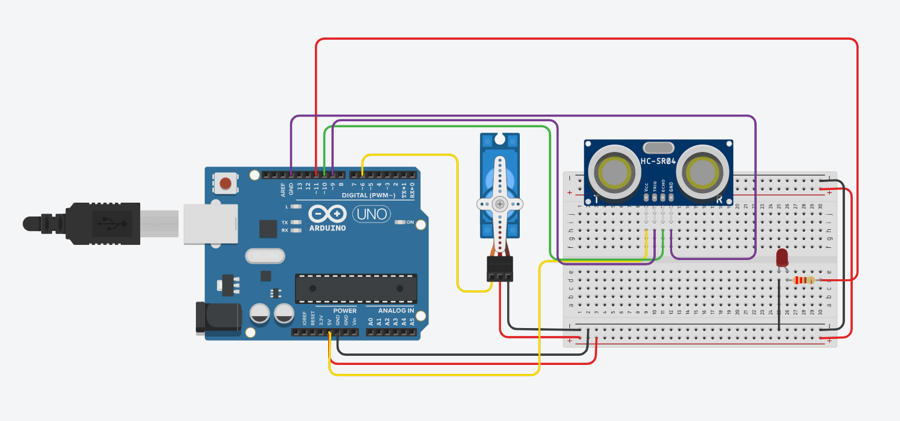

Documentação da Atividade: Cabeça do Robô de Monitoramento de Segurança
Objetivo
Desenvolver uma cabeça de robô capaz de detectar obstáculos e acionar um mecanismo de desvio. O robô deve registrar o ambiente ao seu redor e evitar colisões, iluminando um LED vermelho ao encontrar um obstáculo.

Funções do Robô
Monitorar a empresa durante a noite.
Detectar objetos, pessoas ou paredes à sua frente.
Emitir um sinal ao corpo do robô para que ele gire ao encontrar um obstáculo.
Acender um LED vermelho ao detectar um obstáculo.
Componentes Necessários
Microcontrolador (ex: Arduino)
Sensor ultrassônico (para detecção de distância)
Servomotor (para o movimento da cabeça)
LED vermelho
Resistores (se necessário para o LED)
Fios de conexão
Protoboard (opcional)
Conexões
Sensor Ultrassônico:
Trig: Pino 9
Echo: Pino 10
LED:
Anodo: Pino 11
Catodo: GND
Servomotor:
Controle: Pino 6
VCC: 5V
GND: GND
