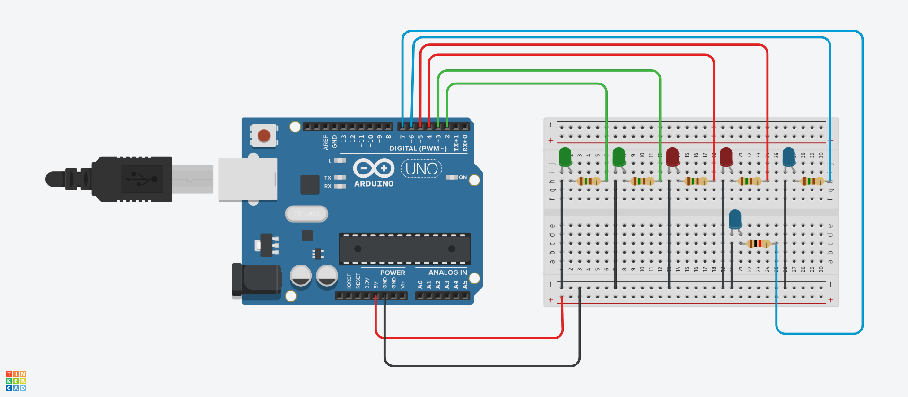

# Projeto de Sinalização com LEDs

# Introdução
Este projeto foi desenvolvido no Tinkercad, com o objetivo de criar um sistema de sinalização utilizando LEDs.
O sistema apresenta diferentes combinações de LEDs em momentos distintos, permitindo visualizar padrões de iluminação.
Os LEDs utilizados são nas cores verde, vermelho e azul, proporcionando um efeito visual interessante. O circuito
é projetado para alternar entre três momentos distintos, cada um com uma configuração específica de LEDs acesos.

#Componentes Usados
1 Arduino Uno
6 LEDs (2 Verdes, 2 Vermelhos, 2 Azuis)
6 Jumpers Macho-Macho
# Montagem do Circuito

# Explicação do Código

Definindo os pinos dos LEDs

const int ledVerde1 = 2;    LED Verde 1

const int ledVerde2 = 3;    LED Verde 2

const int ledVermelho1 = 4; LED Vermelho 1

const int ledVermelho2 = 5; LED Vermelho 2

const int ledAzul1 = 6;     LED Azul 1

const int ledAzul2 = 7;     LED Azul 2

void setup() {
    Configurando os pinos como saída
    pinMode(ledVerde1, OUTPUT);
    pinMode(ledVerde2, OUTPUT);
    pinMode(ledVermelho1, OUTPUT);
    pinMode(ledVermelho2, OUTPUT);
    pinMode(ledAzul1, OUTPUT);
    pinMode(ledAzul2, OUTPUT);
}

void loop() {
    Primeiro momento: 1 Verde, 1 Vermelho, 1 Azul
    digitalWrite(ledVerde1, HIGH);     Liga LED Verde 1
    digitalWrite(ledVermelho1, HIGH);   Liga LED Vermelho 1
    digitalWrite(ledAzul1, HIGH);       Liga LED Azul 1
    delay(2000);                        Mantém aceso por 2 segundos
    digitalWrite(ledVerde1, LOW);      Desliga LED Verde 1
    digitalWrite(ledVermelho1, LOW);    Desliga LED Vermelho 1
    digitalWrite(ledAzul1, LOW);        Desliga LED Azul 1
    delay(500);                         Pausa

   Segundo momento: 2 Verdes e 2 Azuis
   digitalWrite(ledVerde1, HIGH);     Liga LED Verde 1
   digitalWrite(ledVerde2, HIGH);     Liga LED Verde 2
    digitalWrite(ledAzul1, HIGH);       Liga LED Azul 1
   digitalWrite(ledAzul2, HIGH);       Liga LED Azul 2
    delay(2000);                        Mantém aceso por 2 segundos
   digitalWrite(ledVerde1, LOW);      Desliga LED Verde 1
    digitalWrite(ledVerde2, LOW);      Desliga LED Verde 2
   digitalWrite(ledAzul1, LOW);        Desliga LED Azul 1
    digitalWrite(ledAzul2, LOW);        Desliga LED Azul 2
    delay(500);                         Pausa
     Terceiro momento: 1 Verde, 2 Vermelhos e 1 Azul
    digitalWrite(ledVerde1, HIGH);      Liga LED Verde 1
    digitalWrite(ledVermelho1, HIGH);   Liga LED Vermelho 1
    digitalWrite(ledVermelho2, HIGH);   Liga LED Vermelho 2
    digitalWrite(ledAzul1, HIGH);       Liga LED Azul 1
    delay(2000);                        Mantém aceso por 2 segundos
    digitalWrite(ledVerde1, LOW);      Desliga LED Verde 1
    digitalWrite(ledVermelho1, LOW);    Desliga LED Vermelho 1
    digitalWrite(ledVermelho2, LOW);    Desliga LED Vermelho 2
    digitalWrite(ledAzul1, LOW);        Desliga LED Azul 1
    delay(500);                         Pausa
}
Definição das Variáveis
ledVerde1 e ledVerde2: LEDs verdes, utilizados em diferentes momentos do padrão.
ledVermelho1 e ledVermelho2: LEDs vermelhos, que se acendem em conjunto com o LED verde.
ledAzul1 e ledAzul2: LEDs azuis, que também fazem parte dos padrões de iluminação.
Funções Principais
setup(): Configura todos os pinos dos LEDs como saídas, permitindo o controle sobre eles.
loop(): Controla a sequência de iluminação, ativando e desativando os LEDs em diferentes momentos com intervalos definidos.
Esse sistema pode ser aplicado em diversas situações de sinalização ou apresentação visual, permitindo flexibilidade na criação de padrões luminosos.

