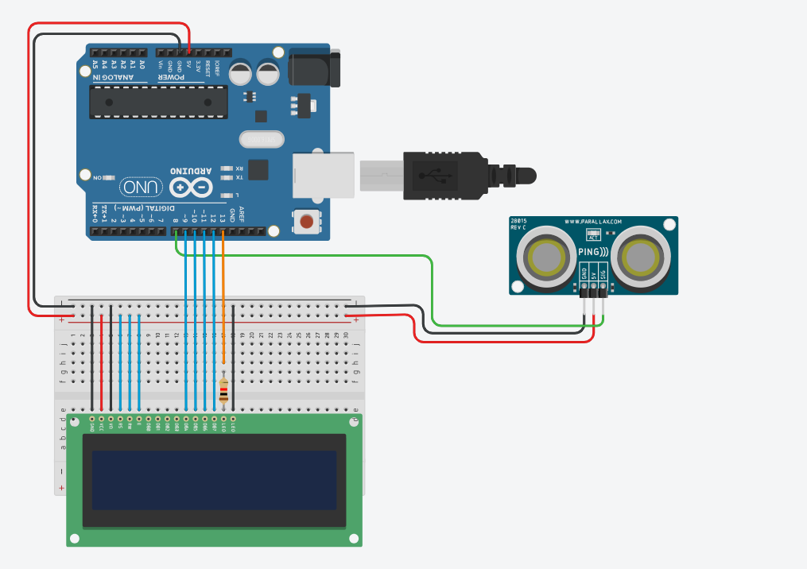

# Projeto de tela LCD com sensor de Distância

este projeto foi desenvolvido dentro do Tinkercad, na disciplina de Internet das coisas 
(IOT), para a criação de um prototipo com arduino que simule uma mensagem de MAntenha 
distância toda vez que alguém se aproxime a menos de 1 metro do sensor.

## Componentes Usdados
- 1 Arduino Uno
- 1 Placa de Ensaio
- 1 Sensor de Distância
- 1 tela LCD 16X2
- 14 Jumpers Macho-Macho
- 3 Jumpers Macho-Fêmea
- 1 Resistor de 1 KOhms

## Montagem do Circuito

## Explicação do Código

Importando a biblioteca do LCD.
#include <LiquidCrystal.h>
Criar variável do LCD
LiquidCrystal lcd(2, 3, 4, 9, 10, 11);
Pino do LED do LCD
int ledLcd = 13;
Método para capturar a distância
long distancia(int trigger, int echo) {
  pinMode(trigger, OUTPUT); definir porta de saída
 digitalWrite(trigger, LOW);  desligar porta
  delay(2);  espera 2 milissegundos
  digitalWrite(trigger, HIGH);  enviando sinal
  delay(10);  espera 10 milissegundos
  digitalWrite(trigger, LOW);  desligar porta
  pinMode(echo, INPUT);  definir porta de entrada
  return pulseIn(echo, HIGH);  retorna os dados que a porta recebe
}

void setup() {
  pinMode(ledLcd, OUTPUT);  Definir ledLcd como saída
  digitalWrite(ledLcd, HIGH);  Ligar os LEDs do LCD
  lcd.begin(16, 2);  Informar que o LCD tem 16 colunas e 2 linhas
  lcd.clear();  Iniciar o LCD limpo
}

void loop() {
  long duration = distancia(8, 7);  Ajuste os pinos conforme necessário
  int cm = duration * 0.034  2;  Calcular a distância em cm
  
  lcd.clear();  Limpa o LCD a cada loop
  if (cm < 100 && cm > 0) {  se menor que 1 metro e maior que 0 cm
    lcd.setCursor(0, 0);  Primeira linha
    lcd.print("MANTENHA");
    lcd.setCursor(0, 1);  Segunda linha
    lcd.print("DISTANCIA");
  }
  delay(100);  Aguarda 100 milissegundos antes da próxima leitura
}

Metodo para inicializar as portas de conexão do lcd, e as configurações iniciais.

void setup()
{
 pinMode(ledLcd,OUTPUT);
 digitalWrite(ledLcd, HIGH);
 lcd.begin(16,2);
 lcd.clear();
}
 
Metodo para executar infinitamente o código de conversão da distancia para cm, e impressao das mensagens de "Mantenha distancia".

void loop()
}
 int cm = 0.01723 * distancia(8, 8);

if (cm>100){
  lcd.setCursor(0.0);

